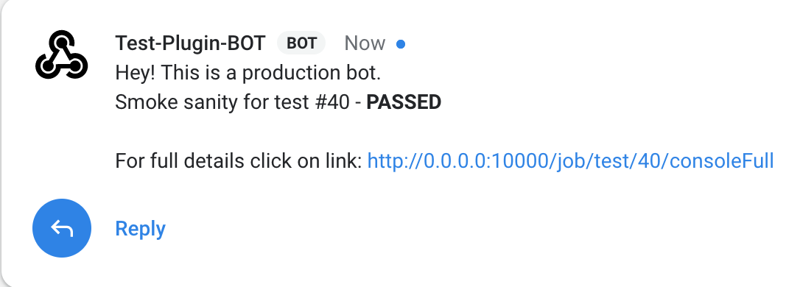

# google-chat-notification-jenkins-plugin

Google Chat Notification Jenkins Plugin to send build status to Google Chat Messenger https://chat.google.com/

This Jenkins plugin allows you to send Google Chat notification as a post build action or as a pipeline script.

## Prerequisites

- You must create a web hook in google chat group to send notification.

## How to configure it in post build action

- Click on Add post-build action button

- Click on Google Chat Notification

- Configure URL (web hook URL configured in prerequisites), message (build message) and type of build result you want to send notification. You can configure multiple URLs separated by comma.

## How to use it in pipeline script

Use below command
### googlechatnotification url: 'web hook(s) URL(s)', message: 'message to be sent'

Please find explanations for each fields as below:

1. **url**
   - Single/Multiple comma separated URLs.
   - This is a mandatory field.

2. **message**
   - Notification message to be sent.
   - This is a mandatory field.

## For user friendly messages there are few pre-defined variables. Please find explanations for each pre-defined variables as below:

1. **$DEFAULT_SUBJECT**
   - This field is replaced with your build full display name.
   - For e.g. <folder_name> » <job_name> #<build_number>

2. **$BUILD_URL**
   - This field is replaced with your build URL.
   - For e.g. <jenkins_url>/job/<job_name>/build

3. **$CONSOLE_URL**
   - This field is replaced with your build console output URL.
   - For e.g. <jenkins_url>/job/<job_name>/<build_number>/console

4. **$CONSOLE_FULL_URL**
   - This field is replaced with your build full console output URL.
   - For e.g. <jenkins_url>/job/<job_name>/<build_number>/consoleFull

Find below example to use pre-defined variables in your message. You can configure message as per your need

*def subject = Hey! This is a production bot.\nSmoke sanity for **$DEFAULT_SUBJECT**\n\nFor full details click on link: **$CONSOLE_FULL_URL***

### googlechatnotification url: 'web hook(s) URL(s)', message: *subject*

Output will look like as below

**Note: You can also use pre-defined variables in message field of Google Chat Notification block in post-build action of normal jobs.**
