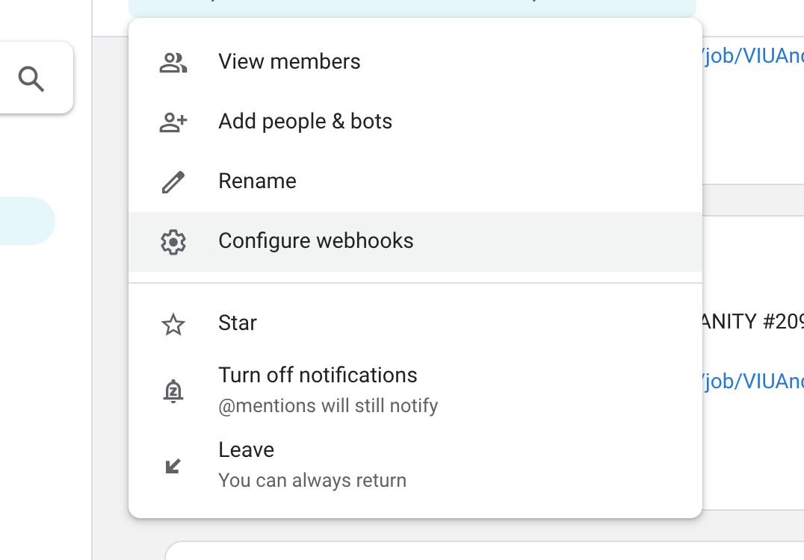
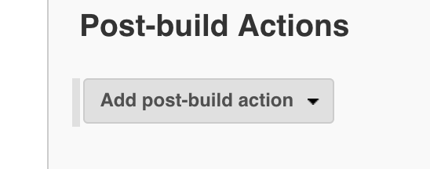
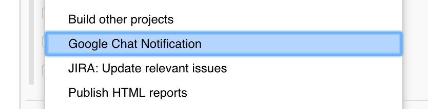
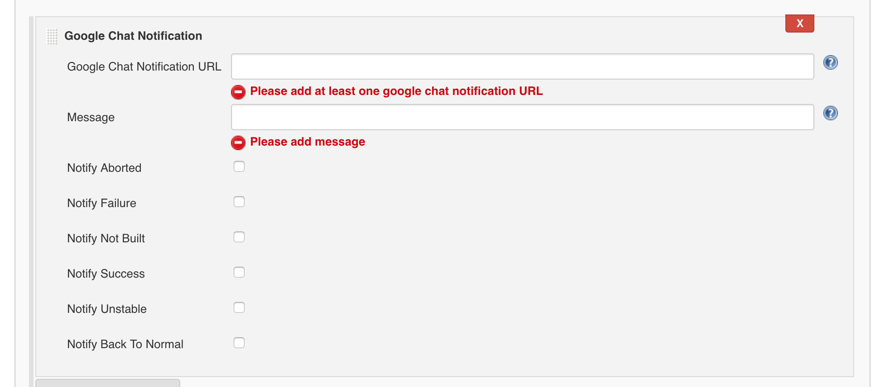
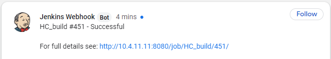

# google-chat-notification-jenkins-plugin

Google Chat Notification Jenkins Plugin to send build status to [Google Chat](https://chat.google.com)

This Jenkins plugin allows you to send Google Chat notification as a post build action or as a pipeline script.
This plugin is supported for Jenkins version **2.60.3 or higher**.


## Prerequisites

- You must create a web hook in google chat group to send notification.




## How to configure it in post build action

- Click on Add post-build action button



- Click on Google Chat Notification



- Configure URL (web hook URL configured in prerequisites), message (build message) and type of build result you want to send notification. You can configure multiple URLs separated by comma.



### Example

Input the following in the 'Message' field:

```
$JOB_NAME #$BUILD_ID - $BUILD_STATUS\n\nFor full details see: $BUILD_URL
```

The resulting message should appear as:



Macros can be used (by adding the '$' symbol).

## How to use it in pipeline script

Use below command
### googlechatnotification url: 'web hook(s) URL(s)', message: 'message to be sent', notifyAborted: 'true', notifyFailure: 'true', notifyNotBuilt: 'true', notifySuccess: 'true', notifyUnstable: 'true', notifyBackToNormal: 'true', suppressInfoLoggers: 'true', sameThreadNotification: 'true'


## Please find explanations for each fields as below, usage for all fields remains same for build job and pipeline:

1. **url**
   - This is a mandatory String parameter.
   - Single/multiple comma separated HTTP URLs or/and single/multiple comma separated Credential IDs.
     - To use Credential ID as URL identifier configure entire URL as secret in credential. Use *id:credential_id_for_room1* as value in URL.

     

   - Different Sample Ways to define URL parameter:
     - https://chat.googleapis.com/v1/spaces/room_id/messages?key=key_id&token=token_id<br/>
     - https://chat.googleapis.com/v1/spaces/room_id/messages?key=key_id&token=token_id, https://chat.googleapis.com/v1/spaces/room_id2/messages?key=key_id2&token=token_id2<br/>
     - id:credential_id_for_room1<br/>
     - id:credential_id_for_room1, id:credential_id_for_room2<br/>
     - https://chat.googleapis.com/v1/spaces/room_id/messages?key=key_id&token=token_id, id:credential_id_for_room2<br/>

2. **message**
   - This is a mandatory String parameter.
   - Notification message to be sent.
   - Supports all token macro variables for pipeline as well as build jobs.

3. **notifyAborted**
   - This is an optional boolean parameter. Default value is false.
   - Notification message to be sent when build status is ABORTED.

4. **notifyFailure**
   - This is an optional boolean parameter. Default value is false.
   - Notification message to be sent when build status is FAILURE.

5. **notifyNotBuilt**
   - This is an optional boolean parameter. Default value is false.
   - Notification message to be sent when build status is NOT_BUILT.

6. **notifySuccess**
   - This is an optional boolean parameter. Default value is false.
   - Notification message to be sent when build status is SUCCESS.

7. **notifyUnstable**
   - This is an optional boolean parameter. Default value is false.
   - Notification message to be sent when build status is UNSTABLE.

8. **notifyBackToNormal**
   - This is an optional boolean parameter. Default value is false.
   - Notification message to be sent when build status is SUCCESS and previous build status was not SUCCESS.

9. **suppressInfoLoggers**
   - This is an optional boolean parameter. Default value is false.
   - Suppress all info loggers in Jenkins build.

9. **sameThreadNotification**
   - This is an optional boolean parameter. Default value is false.
   - This parameter is used to send notification in same thread for a particular job. Here thread_key is a value of JOB_NAME.


## Default behaviour of plugin is to send notifications for all build status unless overridden with true value for above defined build statuses.
